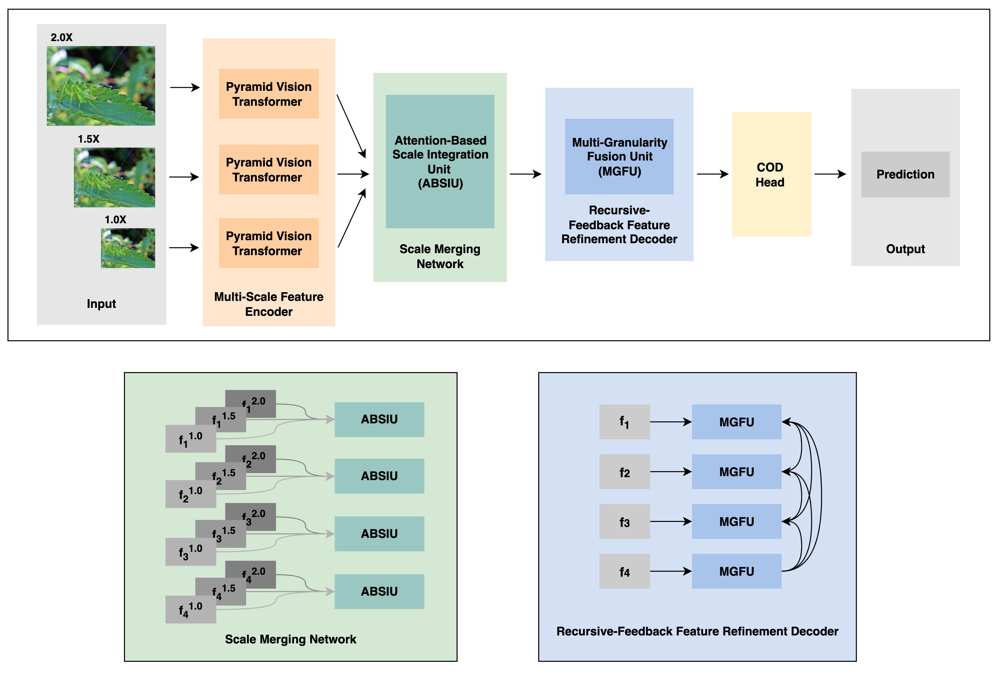
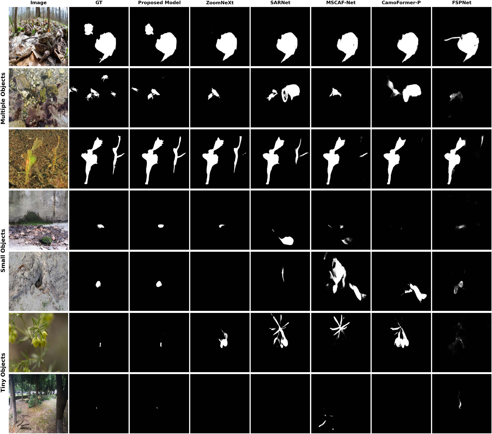

# MSRNet
 MSRNet: A Multi-Scale Recursive Network for Camouflaged Object Detection.
 
## Contents
1. [Introduction](#Introduction)
2. [Network](#Network)
4. [Data Preparation](#Data-Preparation)
5. [Requirements Installation](#Requirements-Installation)
6. [Training](#Training)
7. [Evaluation](#Evaluation)
8. [Results](#Results)
9. [Acknowledgement](#Acknowledgment)

## Introduction

## Network
This diagram illustrates the overall architecture of MSRNet. 


## Data Preparation
In this research, we utilized four benchmark datasets for camouflaged object detection (CAMO, CHAMELEON, COD10K, and NC4K).

After downloading all datasets, you need to create a file named "dataset.yaml" and place it in the same directory as the main code folder.  

The dataset.yaml file will include the paths for your Train and Test datasets. Please ensure that you place the datasets in the corresponding paths as you specified in the dataset.yaml file. 

Your dataset.yaml file should look something like this:

```yaml
# ICOD Datasets
cod10k_tr:
  {
    root: "YOUR_ROOT_DIRECTRY/ICOD_Datasets/Train/COD10K-TR",
    image: { path: "Image", suffix: ".jpg" },
    mask: { path: "Mask", suffix: ".png" },
  }
camo_tr:
  {
    root: "YOUR_ROOT_DIRECTRY/ICOD_Datasets/Train/CAMO-TR",
    image: { path: "Image", suffix: ".jpg" },
    mask: { path: "Mask", suffix: ".png" },
  }
cod10k_te:
  {
    root: "YOUR_ROOT_DIRECTRY/ICOD_Datasets/Test/COD10K-TE",
    image: { path: "Image", suffix: ".jpg" },
    mask: { path: "Mask", suffix: ".png" },
  }
camo_te:
  {
    root: "YOUR_ROOT_DIRECTRY/ICOD_Datasets/Test/CAMO-TE",
    image: { path: "Image", suffix: ".jpg" },
    mask: { path: "Mask", suffix: ".png" },
  }
chameleon:
  {
    root: "YOUR_ROOT_DIRECTRY/ICOD_Datasets/Test/CHAMELEON",
    image: { path: "Image", suffix: ".jpg" },
    mask: { path: "Mask", suffix: ".png" },
  }
nc4k:
  {
    root: "YOUR_ROOT_DIRECTRY/ICOD_Datasets/Test/NC4K",
    image: { path: "Imgs", suffix: ".jpg" },
    mask: { path: "GT", suffix: ".png" },
  }
```
## Requirements Installation

* torch==2.1.2
* torchvision==0.16.2
* Others: `pip install -r requirements.txt`

## Training

```shell
python main_for_image.py --config configs/icod_train.py --pretrained --model-name EffB1_MSRNet
python main_for_image.py --config configs/icod_train.py --pretrained --model-name EffB4_MSRNet
python main_for_image.py --config configs/icod_train.py --pretrained --model-name PvtV2B2_MSRNet
python main_for_image.py --config configs/icod_train.py --pretrained --model-name PvtV2B3_MSRNet
python main_for_image.py --config configs/icod_train.py --pretrained --model-name PvtV2B4_MSRNet
python main_for_image.py --config configs/icod_train.py --pretrained --model-name PvtV2B5_MSRNet
python main_for_image.py --config configs/icod_train.py --pretrained --model-name RN50_MSRNet
```
> [!note]
> These command-lines will not save the final predection images of the trained model, to save the predection sesults of your traind model add --save-results to your command-line.


## Evaluation

```shell
python main_for_image.py --config configs/icod_train.py --model-name <MODEL_NAME> --evaluate --load-from <TRAINED_WEIGHT>
```


## Results
The prediction results of our highest-performing model (PvtV2B4_MSRNet) on [CAMO](https://drive.google.com/drive/folders/12HoC5l_0gL_JjpCIBHO5sevMLTbZT6zP?usp=drive_link), [CHAMELEON](https://drive.google.com/drive/folders/1p0i6y3seR0a_RBPzlXYIKxaif3A9ZytT?usp=drive_link), [COD10K](https://drive.google.com/drive/folders/10yR26pNG4La7ikNJTKmu9qGLJp5xwcYS?usp=drive_link), and [NC4K](https://drive.google.com/drive/folders/19xBkQUVZ597n8Ilav3QKsBRvQVhf3WOQ?usp=drive_link) are available, along with the [model weights](https://drive.google.com/file/d/12M_Cw9B96z9QpeGq5wRPW5ZGJlavJs0L/view?usp=drive_link). 

### MSRNet Performance Results

| Backbone        | CAMO  |                      |       |           |       |CHAMELEON |                      |       |           |       | COD10K |                      |       |           |       | NC4K  |                      |       |           |       |
| --------------- | ----- | -------------------- | ----- | ----------|-------|--------- | -------------------- | ----- | ----------|-------| -------| -------------------- | ----- | ----------|-------| ----- | -------------------- | ----- |---------- |-------|
|                 | $S_m$ | $F^{\omega}_{\beta}$ | MAE   |$F_{\beta}$|$E_{m}$|$S_m$     | $F^{\omega}_{\beta}$ | MAE   |$F_{\beta}$|$E_{m}$| $S_m$  | $F^{\omega}_{\beta}$ | MAE   |$F_{\beta}$|$E_{m}$| $S_m$ | $F^{\omega}_{\beta}$ | MAE   |$F_{\beta}$|$E_{m}$|
| ResNet-50       | 0.816 | 0.754                | 0.071 | 0.794     | 0.872 |0.918     | 0.876                | 0.020 | 0.888     | 0.975 | 0.868  | 0.786                | 0.024 | 0.816     | 0.934 | 0.869 | 0.814                | 0.039 | 0.844     | 0.925 |
| EfficientNet-B4 | 0.875 | 0.838                | 0.045 | 0.863     | 0.936 |0.923     | 0.881                | 0.019 | 0.891     | 0.970 | 0.887  | 0.814                | 0.020 | 0.838     | 0.947 | 0.889 | 0.844                | 0.031 | 0.866     | 0.943 |
| PVTv2-B2        | 0.873 | 0.838                | 0.047 | 0.860     | 0.928 |0.931     | 0.904                | 0.016 | 0.912     | 0.976 | 0.894  | 0.829                | 0.018 | 0.849     | 0.952 | 0.894 | 0.853                | 0.030 | 0.874     | 0.943 |
| PVTv2-B3        | 0.885 | 0.855                | 0.043 | 0.874     | 0.941 |0.933     | 0.907                | 0.016 | 0.915     | 0.973 | 0.904  | 0.847                | 0.017 | 0.865     | 0.959 | 0.903 | 0.867                | 0.027 | 0.886     | 0.952 |
| PVTv2-B4        | 0.888 | 0.861                | 0.040 | 0.878     | 0.942 |0.932     | 0.908                | 0.017 | 0.916     | 0.978 | 0.907  | 0.852                | 0.016 | 0.868     | 0.962 | 0.905 | 0.873                | 0.026 | 0.890     | 0.953 |
| PVTv2-B5        | 0.888 | 0.860                | 0.041 | 0.876     | 0.943 |0.925     | 0.893                | 0.017 | 0.903     | 0.971 | 0.902  | 0.844                | 0.017 | 0.862     | 0.957 | 0.903 | 0.871                | 0.027 | 0.889     | 0.952 |


### MSRNet Visual Results

A visual Comparison showing the superiority of MSRNet in detecting multiple (rows 1-3), small (rows 4 and 5), and tiny (rows 6 and 7) camouflaged objects.



 

## Acknowledgment
This project builds upon the work of [Lart Pang](https://github.com/lartpang), incorporating key modifications to the decoding strategy and input scales to enhance its ability to detect small and multiple camouflaged objects. 
